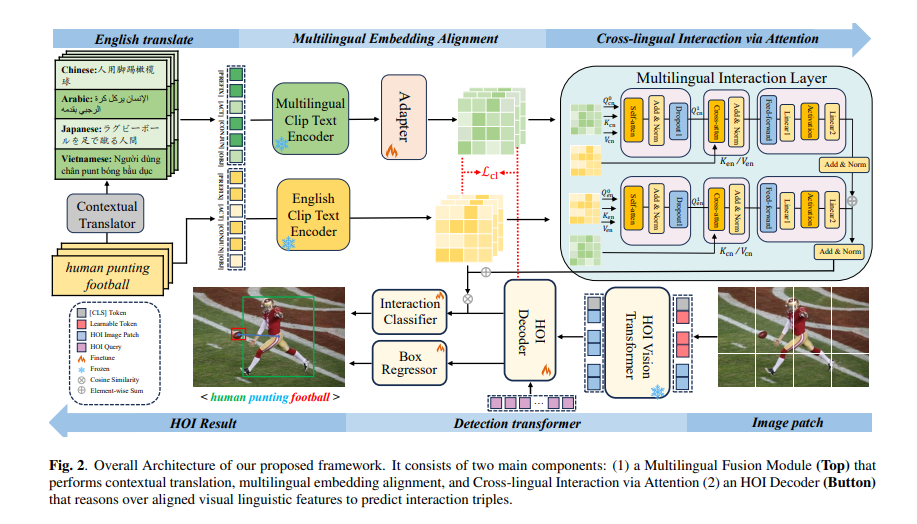

# Language Matters: Multilingual Alignment for Open-vocabulary Human-Object Interaction Detection

## Overview
**Abstract:** Recently, vision-language models (VLMs) have made significant progress in open-vocabulary human-object interaction (OV-HOI) detection. However, they typically rely on large language models (LLMs) to extend and refine only English-based representations, which suffer from polysemy issues inherent in a single language. In contrast, our approach does not depend on LLMs for text expansion. Instead, we propose a multilingual fusion framework that integrates translations of HOI descriptions into multiple languages with the original English embeddings. This results in richer, cross-linguistic representations that are aligned with visual features. Furthermore, to address challenges such as English polysemy and cross-cultural semantic divergence, we introduce a Bidirectional Attention Mechanism to refine the fused representations, improving the model’s performance across diverse linguistic and cultural settings. Experiments demonstrate state-of-the-art detection accuracy on the SWIG dataset and decent performance on HICO-DET, validating the effectiveness of multilingual semantic augmentation for HOI detection.



## Preparation

### Installation

Our codebase is built upon CLIP and requires the installation of PyTorch, torchvision, and a few additional dependencies.


```bash
#conda environment
conda create -n LMHOI python==3.10
conda activate LMHOI
pip install torch==1.12.1+cu113 torchvision==0.13.1+cu113 torchaudio==0.12.1 --extra-index-url https://download.pytorch.org/whl/cu113
#chinese clip/japanse clip
pip install cn_clip
cd Chinese-CLIP
pip install -e .

#another packet
pip install -r requirements.txt
```

### Dataset

Our experiments are mainly carried out on the **HICO-DET** and **SWIG-HOI** benchmarks. For dataset preparation, we follow the guidelines from the [HICO-DET repository](https://github.com/YueLiao/PPDM) and use the instructions provided in the [SWIG-HOI repository](https://github.com/scwangdyd/large_vocabulary_hoi_detection).

#### SWIG-DET

The SWIG-DET dataset can be downloaded from [here](https://swig-data-weights.s3.us-east-2.amazonaws.com/images_512.zip). After downloading, extract the `images_512.zip` file into the `data` directory. Annotation files can be downloaded from [here](https://drive.google.com/open?id=1GxNP99J0KP6Pwfekij_M1Z0moHziX8QN). Please ensure that the downloaded files are placed according to the following directory structure. Alternatively, you can modify the default paths to your custom locations in [datasets/swig.py](./datasets/swig.py)


``` plain
 |─ data
 │   └─ swig_hoi
 |       |- images_512
 |       |─ annotations
 |       |   |─ swig_train_1000.json
 |       |   |- swig_val_1000.json
 |       |   |─ swig_trainval_1000.json
 |       |   |- swig_test_1000.json
 :       :
```


#### HICO-DET

he **HICO-DET** dataset is available for download from [this link](https://drive.google.com/open?id=1QZcJmGVlF9f4h-XLWe9Gkmnmj2z1gSnk). Once downloaded, the archive `hico_20160224_det.tar.gz` should be extracted into the `data` folder. For annotations, we adopt the files released by the authors of [PPDM](https://github.com/YueLiao/PPDM) and further refine them by incorporating additional metadata, including image width and height. The processed annotation files can be obtained from [here](https://drive.google.com/open?id=1lqmevkw8fjDuTqsOOgzg07Kf6lXhK2rg). Please arrange the files following the directory structure shown below, or alternatively, adjust the default paths in [datasets/hico.py](./datasets/hico.py) to point to your custom locations.

``` plain
 |─ data
 │   └─ hico_20160224_det
 |       |- images
 |       |   |─ test2015
 |       |   |─ train2015
 |       |─ annotations
 |       |   |─ trainval_hico_ann.json
 |       |   |─ test_hico_ann.json
 :       :
```

#### 

### Muti-language clip

- [Chinese-CLIP](https://github.com/OFA-Sys/Chinese-CLIP)|[model](https://www.modelscope.cn/models/AI-ModelScope/chinese-clip-vit-base-patch16)

- [Japanese](https://github.com/rinnakk/japanese-clip)

- [(Arabic Clip_HuggingFace) ](https://huggingface.co/Arabic-Clip)


## Training

Run this command to train the model in SWIG-HOI dataset

``` bash
bash ./tools/train_swig.sh
```

Run this command to train the model in HICO-DET dataset

``` bash
bash ./tools/train_hico.sh
```


## Inference

Run this command to evaluate the model on HICO-DET dataset

``` bash
bash ./tools/test_hico.sh
```

Run this command to evaluate the model on SWIG-HOI dataset

``` bash
bash ./tools/test_swig.sh
```

## Models

| Dataset  | Non-Rare | Rare  | Unseen | Full  |                          Ckeckpoint                          |
| :------: | :------: | :---: | :----: | :---: | :----------------------------------------------------------: |
| SWIG-HOI |  24.28   | 17.20 | 12.43  | 17.67 | [CKPT](https://pan.baidu.com/s/19uRlr_FK-bEFEFE5t7jPNg?pwd=qqyy ) |


| Dataset  | Unseen | Seen  | Full  | Ckeckpoint |
|:----------:|:--------:|:-------:|:-------:|:-------------:|
| HICO-Det | 20.21 | 28.35 | 26.55 | [CKPT](https://pan.baidu.com/s/19uRlr_FK-bEFEFE5t7jPNg?pwd=qqyy ) |

## Acknowledgments 
We gratefully acknowledge the authors of the following repositories, from which portions of our code are adapted.

- [Lin's repository](https://github.com/Phil0212/SGC-Net)

+ [Lei's repository](https://github.com/ltttpku/CMD-SE-release)
+ [Wang's repository](https://github.com/scwangdyd/promting_hoi) 

